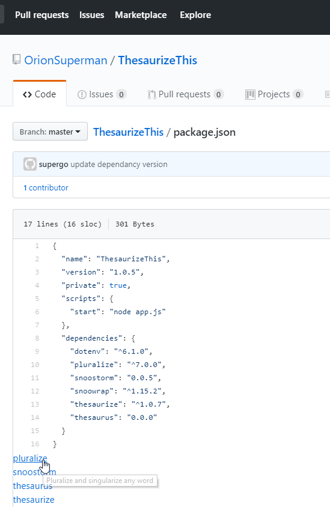

# Npm GitHub Linker - Chrome Extension

When you visit a package.json blob on GitHuib, this extension will enumerate dependencies, devDependencies, and peerDependencies and then append them under as links to npm.

It will also use the NPM Register and load up each links title with the package description if it can.

